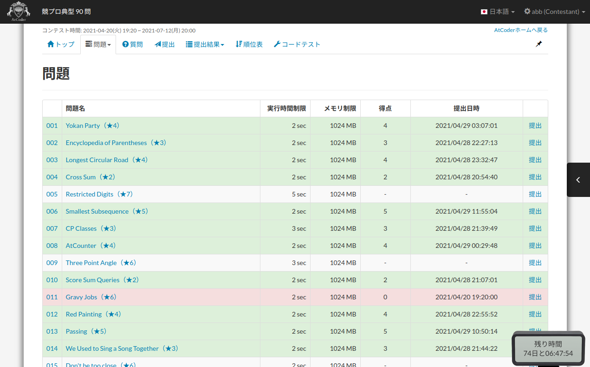

atcoder-tasks-page-colorize-during-contests
=====

## 概要

AtCoder のコンテスト開催中に，tasks ページにおいて，提出した問題に色付けを行います．

開催中のコンテストの色付けについて，[atcoder\-tasks\-page\-colorizer](https://greasyfork.org/ja/scripts/380404-atcoder-tasks-page-colorizer) が対応していないため，これを補完します．

## 機能

- [atcoder\-tasks\-page\-colorizer](https://greasyfork.org/ja/scripts/380404-atcoder-tasks-page-colorizer) と同様の色付けを，コンテスト中にも行えるようにします．

## Greasy Fork 配布ページ

- TODO

## 使用方法

Tampermonkey 等で読み込んで使用してください．

## 更新履歴

- 2021.5.6.0
  - 初版
